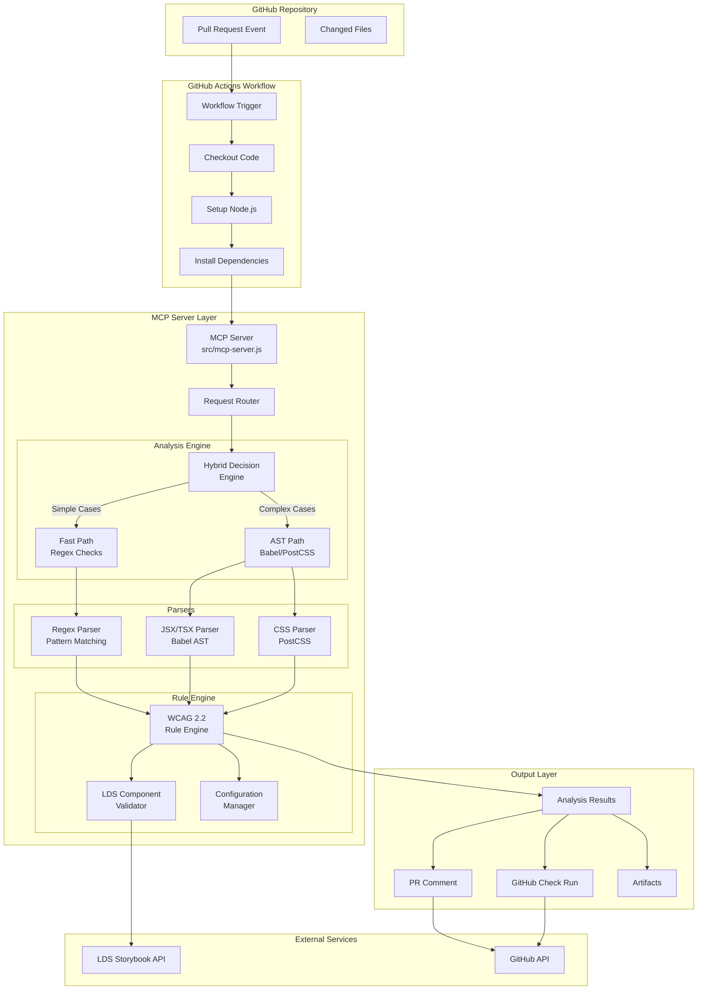
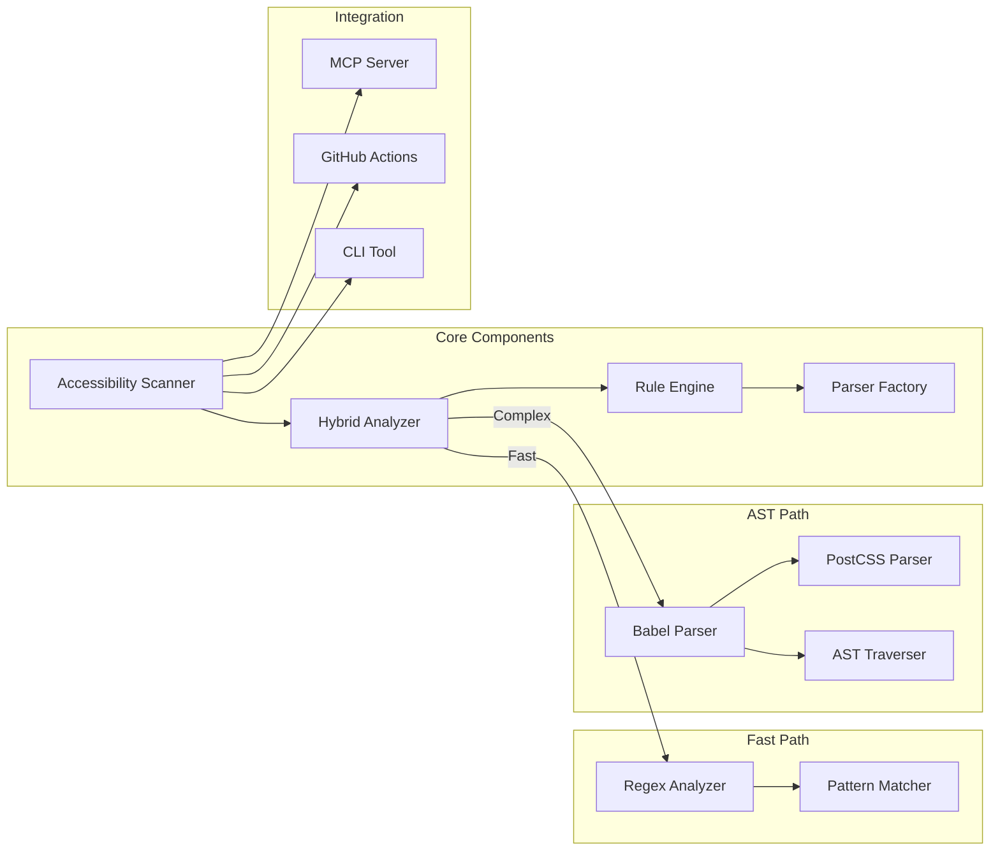
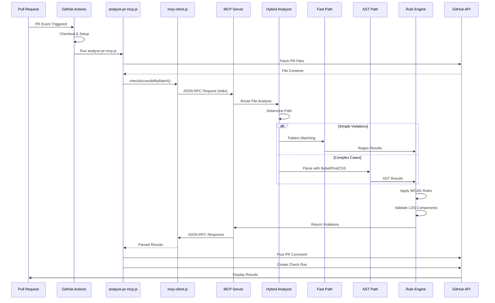
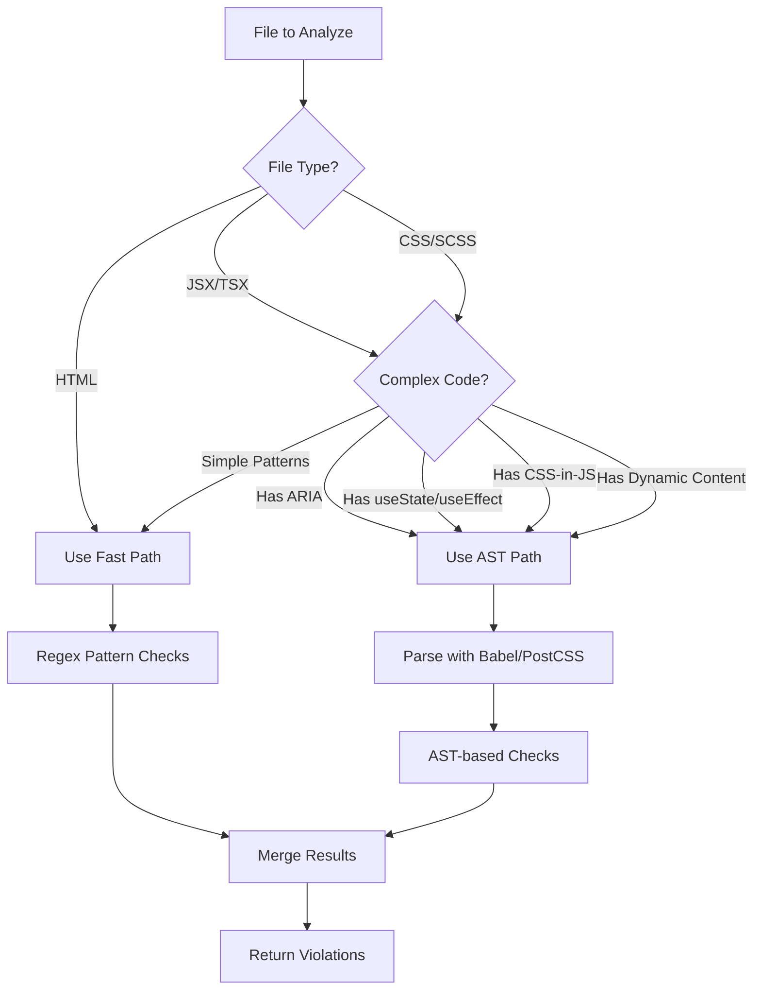
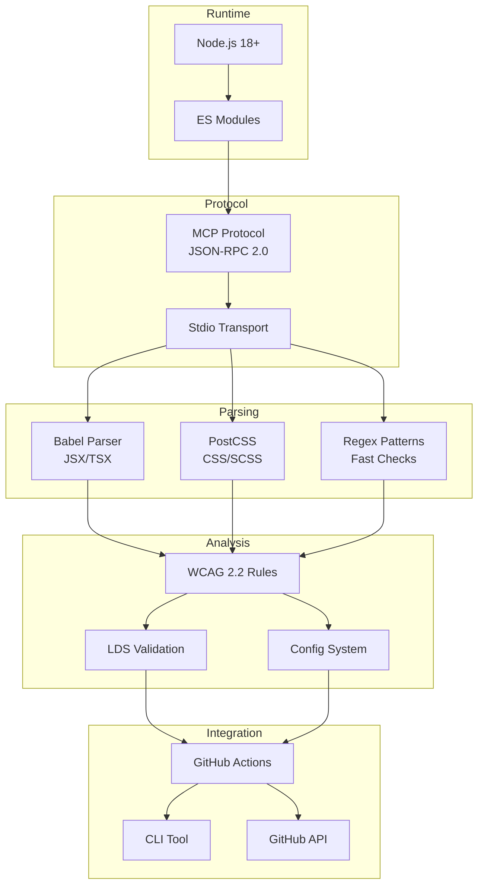

# Architecture Diagram - GitHub Accessibility Reviewer MCP

## System Architecture Overview



## Component Architecture



## Data Flow



## Hybrid Decision Logic



## Technology Stack



## File Structure

```
a11y-mcp/
├── src/
│   ├── core/
│   │   ├── scanner.ts          # Main scanner orchestrator
│   │   ├── hybrid-analyzer.ts  # Hybrid decision engine
│   │   └── rule-engine.ts      # WCAG rule engine
│   ├── parsers/
│   │   ├── fast-parser.ts      # Regex-based fast parser
│   │   ├── ast-parser.ts       # AST-based parser
│   │   ├── javascript.ts        # Babel JSX/TSX parser
│   │   └── css.ts              # PostCSS parser
│   ├── rules/
│   │   ├── wcag-rules.ts       # WCAG 2.2 rules
│   │   ├── lds-rules.ts        # LDS component rules
│   │   └── custom-rules.ts      # Custom rule definitions
│   ├── integration/
│   │   ├── mcp-server.ts       # MCP server implementation
│   │   ├── github-actions.ts   # GitHub Actions integration
│   │   └── cli.ts              # CLI interface
│   └── utils/
│       ├── color-contrast.ts   # Color contrast calculator
│       └── config.ts           # Configuration management
├── scripts/
│   ├── setup.js                # Easy integration script
│   └── analyze-pr.js           # PR analysis script
├── .github/
│   └── workflows/
│       └── accessibility-review.yml
└── docs/
    └── ARCHITECTURE.md         # This file
```

## Performance Characteristics

| Component | Speed | Accuracy | Use Case |
|-----------|-------|----------|----------|
| **Fast Path (Regex)** | ⚡⚡⚡⚡⚡ | ⚡⚡⚡ | Simple violations, large files |
| **AST Path** | ⚡⚡ | ⚡⚡⚡⚡⚡ | Complex violations, dynamic code |
| **Hybrid** | ⚡⚡⚡⚡ | ⚡⚡⚡⚡⚡ | Production (best of both) |

## Integration Points

1. **GitHub Actions**: Automated PR checks
2. **MCP Protocol**: Standardized tool interface
3. **CLI Tool**: Local development
4. **LDS Storybook**: Component validation
5. **Configuration**: Per-repo customization

---

**Version**: 2.0.0 (Production Ready)
**Last Updated**: Current session
