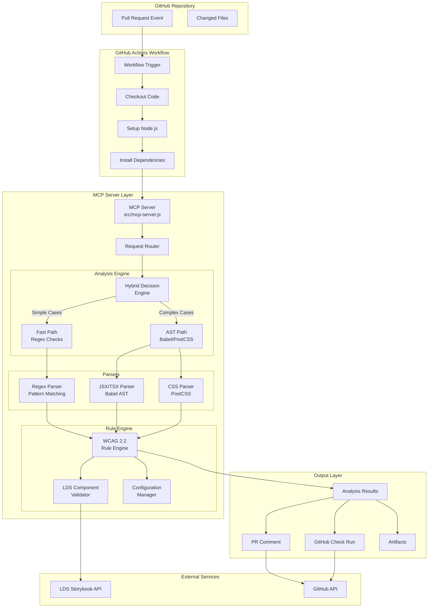
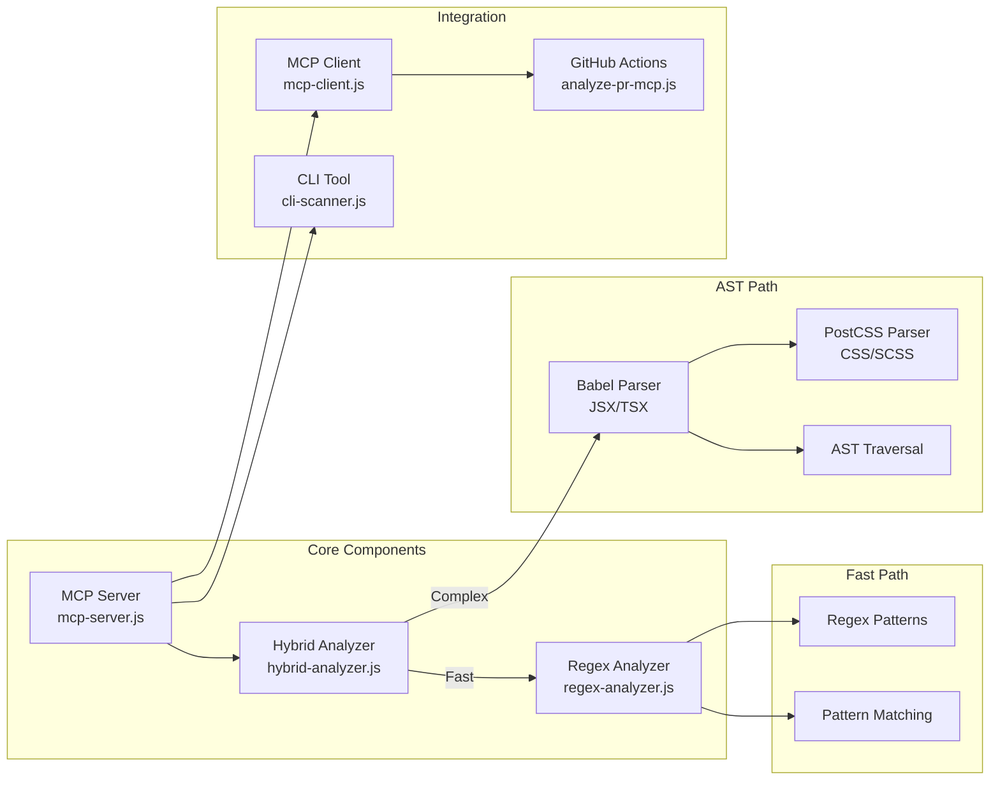
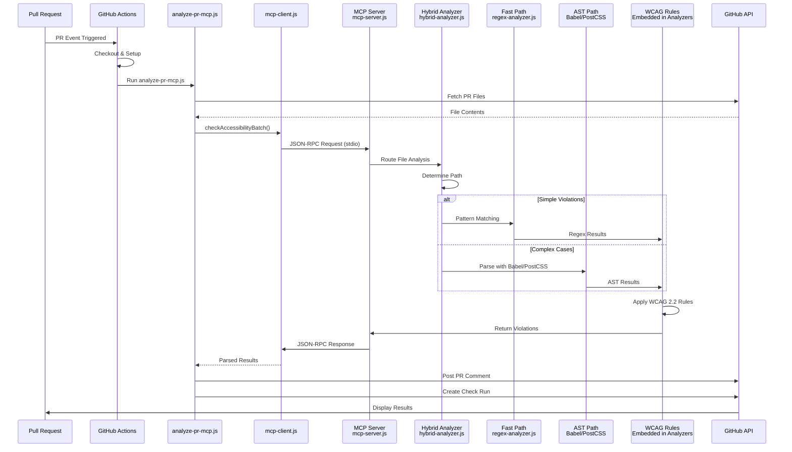
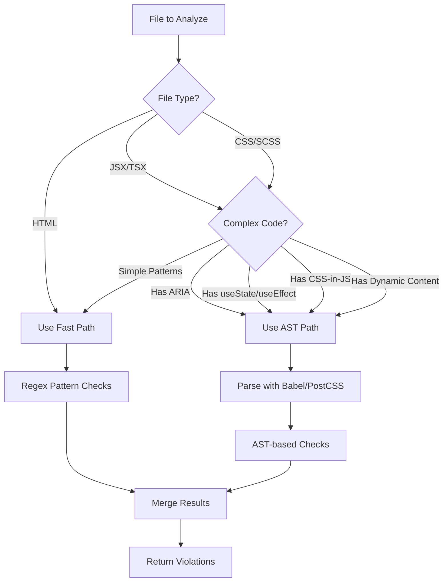
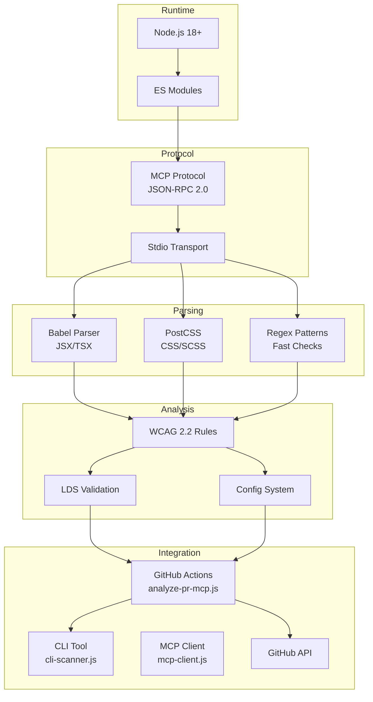

# Architecture Diagram - GitHub Accessibility Reviewer MCP

## System Architecture Overview



## Component Architecture



## Data Flow



## Hybrid Decision Logic



## Technology Stack



## File Structure

```
a11y-mcp/
├── src/
│   ├── core/
│   │   ├── hybrid-analyzer.js  # Hybrid decision engine (fast regex + AST)
│   │   └── regex-analyzer.js   # Fast regex-based analyzer
│   └── mcp-server.js           # MCP server implementation (JSON-RPC)
├── scripts/
│   ├── analyze-pr-mcp.js       # GitHub Actions PR analyzer
│   ├── mcp-client.js           # MCP client for JSON-RPC communication
│   ├── color-contrast.js       # Color contrast calculator
│   ├── scan-parallel.js        # Parallel file scanning
│   ├── setup-integration.js    # Easy integration setup script
│   └── test-mcp-integration.js # MCP integration tests
├── cli-scanner.js              # Standalone CLI tool
├── run.sh                      # Batch file scanner script
├── github-actions/
│   └── accessibility-review.yml # GitHub Actions workflow
├── examples/                   # Test files with violations
├── tests/
│   └── accessibility-checks.test.js # Test suite
└── docs/
    └── architecture/
        └── ARCHITECTURE.md     # This file
```

## Performance Characteristics

| Component | Speed | Accuracy | Use Case |
|-----------|-------|----------|----------|
| **Fast Path (Regex)** | ⚡⚡⚡⚡⚡ | ⚡⚡⚡ | Simple violations, large files |
| **AST Path** | ⚡⚡ | ⚡⚡⚡⚡⚡ | Complex violations, dynamic code |
| **Hybrid** | ⚡⚡⚡⚡ | ⚡⚡⚡⚡⚡ | Production (best of both) |

## Integration Points

1. **GitHub Actions**: Automated PR checks via `analyze-pr-mcp.js`
2. **MCP Protocol**: Standardized tool interface (JSON-RPC via stdio)
3. **CLI Tool**: Local development via `cli-scanner.js`
4. **MCP Client**: `mcp-client.js` for programmatic access
5. **GitHub API**: PR comments and check runs via `@octokit/rest`

**Planned Integrations:**
- **LDS Storybook**: Component validation (Phase 2)
- **Configuration**: Per-repo customization (Phase 3)

---

**Version**: 2.0.0 (Production Ready)
**Last Updated**: Current session
